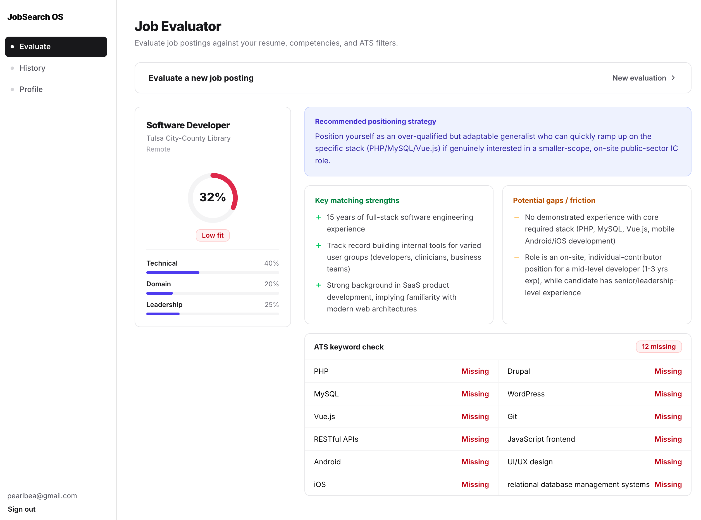

# JobSearch OS



A personal job-search assistant. Build a candidate profile once, then paste in
job postings to get an instant, structured fit evaluation — a 0–100 match
score, a technical/domain/scope breakdown, an ATS keyword scan, and short
positioning advice — all generated by Claude.

## How it works

1. **Sign in** (email/password via Supabase Auth).
2. **Build your profile** — resume text, target job titles, location
   preference, and technical skills.
3. **Evaluate a job posting** — paste in a job description (and optionally
   its URL). The app cleans up boilerplate legal/EOE text, sends it to Claude
   alongside your profile, and stores the result.
4. **Review the evaluation** — match score with a technical/domain/scope
   breakdown, key strengths, potential gaps, an ATS pass-likelihood read with
   missing keywords, and a one-line positioning strategy.

Evaluations are saved to your account so you can revisit them later.

## Tech stack

- [Next.js](https://nextjs.org) (App Router) + React + TypeScript
- [Supabase](https://supabase.com) for auth and data storage
- [Claude](https://www.anthropic.com/claude) via the [Vercel AI SDK](https://sdk.vercel.ai) for job evaluation
- Tailwind CSS + shadcn-style components

## Installation

### Prerequisites

- Node.js
- A [Supabase](https://supabase.com) project
- An **Anthropic API key** — evaluations are powered by Claude, so the app
  will not work without one. Get one at
  [console.anthropic.com](https://console.anthropic.com).

### Setup

1. Clone the repo and install dependencies:

   ```bash
   npm install
   ```

2. In your Supabase project, create tables matching the shapes defined in
   [`types/database.ts`](types/database.ts): `profiles`, `jobs`, and
   `stories`. Enable email/password auth.

3. Create a `.env.local` file in the project root:

   ```bash
   NEXT_PUBLIC_SUPABASE_URL=your-supabase-project-url
   NEXT_PUBLIC_SUPABASE_PUBLISHABLE_KEY=your-supabase-publishable-key
   ANTHROPIC_API_KEY=your-anthropic-api-key
   ```

4. Start the dev server:

   ```bash
   npm run dev
   ```

   The app runs at [http://localhost:3000](http://localhost:3000).

### Other commands

```bash
npm run build   # production build
npm start       # run the production build
npm run lint    # lint
npm test        # run tests once
npm run test:watch
```

## Roadmap

Planned but not yet built:

- **Application tracking** — move evaluated jobs through a pipeline
  (bookmarked → outreach sent → applied → interviewing → offer), beyond
  today's read-only evaluation view.
- **RAG cover-letter generator** — draft cover letters grounded in your
  profile and saved stories/accomplishments, retrieved and woven in for each
  specific job posting rather than generated from scratch.
