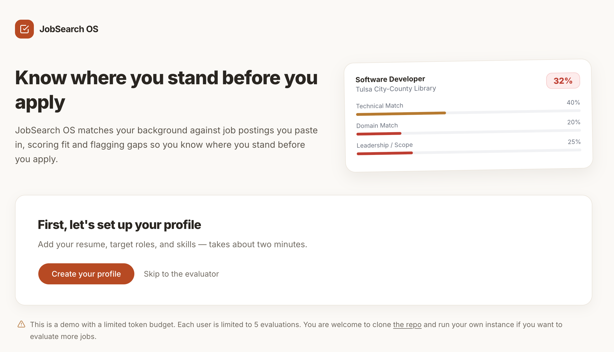
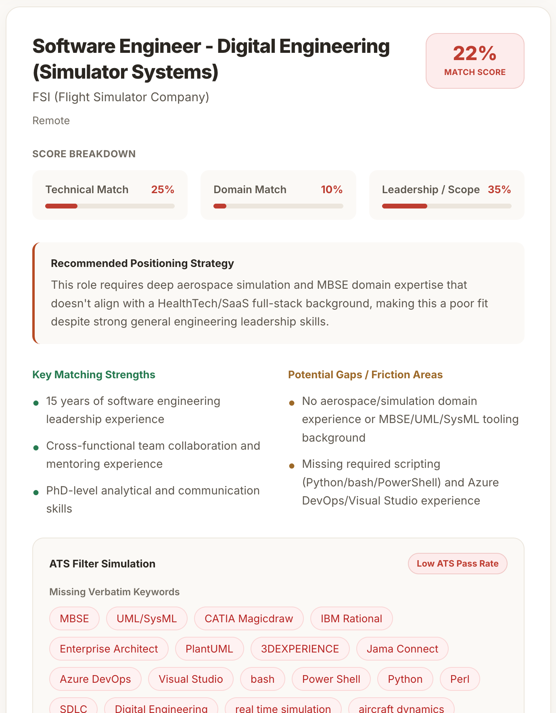

# JobFit Scorecard

A personal job-search assistant. Track the jobs you're pursuing and evaluate
each one against your resume to get a structured fit evaluation: an overall
fit rating, a technical/domain/scope breakdown, a keyword match, and
short positioning advice — all generated by Claude.





## How it works

1. **Sign in** (email/password via Supabase Auth).
2. **Add a job** to your tracker — role, company, and optionally the posting's
   URL and job description.
3. **Evaluate it** from the job's page, against either your profile resume
   or a resume tailored to that job. The app cleans up boilerplate legal/EOE
   text and strips PII from your resume, sends both to Claude, and stores the
   result. Re-evaluate any time; each run is kept in the job's history.
4. **Review the evaluation** — an overall fit rating (Poor fit, Stretch,
   Good fit, or Strong fit) with a technical/domain/scope breakdown, key
   strengths, potential gaps, posting keywords missing from your resume,
   and a one-line positioning strategy. Behind the rating is a
   0–100 score: a weighted average of the three breakdown dimensions
   (currently ~33% each, see [`lib/score-dimensions.ts`](lib/score-dimensions.ts)),
   not a separate number Claude picks on its own. The app shows only the
   rating band ([`lib/score-band.ts`](lib/score-band.ts)), because the score
   shifts a few points between runs and the exact number would overstate
   its precision.
5. **Track the application** — status, dates, contacts, salary, next steps,
   notes, and a log of conversations and interviews.

## Tech stack

- [Next.js](https://nextjs.org) (App Router) + React + TypeScript
- [Supabase](https://supabase.com) for auth and data storage
- [Claude](https://www.anthropic.com/claude) via the [Vercel AI SDK](https://sdk.vercel.ai) for job evaluation
- Tailwind CSS + shadcn-style components

## Installation

### Prerequisites

- Node.js
- A [Supabase](https://supabase.com) project
- An **Anthropic API key** — evaluations are powered by Claude, so the app
  will not work without one. Get one at
  [console.anthropic.com](https://console.anthropic.com).

### Setup

1. Clone the repo and install dependencies:

   ```bash
   npm install
   ```

2. Set up the database: in your Supabase project's **SQL Editor**, paste and
   run the contents of [`supabase/schema.sql`](supabase/schema.sql). It
   creates every table, index, and row-level-security policy the app needs,
   and it's safe to run again. Then enable email/password auth under
   **Authentication → Providers**.

   (`supabase/migrations/` holds the incremental changes applied to the
   original project over time. You don't need them for a new database;
   `schema.sql` already includes them.)

3. Create a `.env.local` file in the project root:

   ```bash
   NEXT_PUBLIC_SUPABASE_URL=your-supabase-project-url
   NEXT_PUBLIC_SUPABASE_PUBLISHABLE_KEY=your-supabase-publishable-key
   ANTHROPIC_API_KEY=your-anthropic-api-key
   ```

4. Start the dev server:

   ```bash
   npm run dev
   ```

   The app runs at [http://localhost:3000](http://localhost:3000).

### Other commands

```bash
npm run build   # production build
npm start       # run the production build
npm run lint    # lint
npm test        # run tests once
npm run test:watch
npm run eval    # evaluation quality checks against the real Claude API
```

`npm run eval` runs fixed resume/job pairs from [`evals/fixtures/`](evals/fixtures/)
through the evaluation engine several times each (`EVAL_RUNS`, default 5) and
checks score stability, calibration, dimension independence, and keyword
detection. It uses your `ANTHROPIC_API_KEY` (about 20 calls per run) and is
not part of `npm test`.

### CI

GitHub Actions runs lint, typecheck, tests, and a build on every pull request
and push to `main` ([`ci.yml`](.github/workflows/ci.yml)). The evals
([`eval.yml`](.github/workflows/eval.yml)) run only when a file that shapes
the evaluation changes, or manually from the Actions tab, and post their
summary table on the run page. They need an `ANTHROPIC_API_KEY` repository
secret (**Settings → Secrets and variables → Actions**), and they're skipped
on pull requests from forks, which don't receive secrets.
